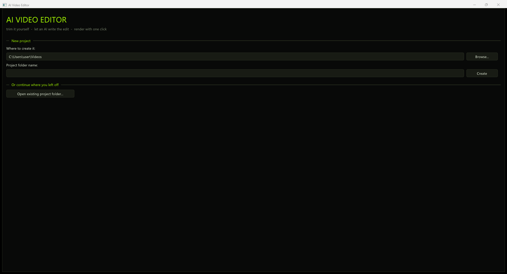

# AI Video Editor

**You mark the moments. Your AI directs the whole edit. FFmpeg renders it.
No subscriptions, no API keys.**

A fast, folder-based video editor for Windows that hands the *entire* edit to
any AI chatbot you already use (ChatGPT, Claude, Gemini, a local model). You
give it raw footage, markers and ideas; it replies with a small **program** in
the AIVE_SCRIPT language that composes the whole video — timeline, pacing,
layers, effects — and the app renders it.



## How it works

```
raw videos + markers + ideas ──> [1 Mark up] ──> [2 Prompt] ──> your AI writes
                                                                an AIVE_SCRIPT
final .mp4  <───────────────────  [3 Edit + Render]  <────────  program
```

Three steps. Everything lives in one project folder you can zip, move, or
re-open later.

## Requirements

- Windows 10/11 with DirectX 11
- **FFmpeg** (`ffmpeg.exe` + `ffprobe.exe`):

```bash
winget install Gyan.FFmpeg
```

then restart the app (or click **Re-detect**).

## Building from source

CMake + Ninja + clang++ (MSYS2 `clang64` works out of the box). Dear ImGui is
vendored in `vendor/imgui`.

```bash
cmake -S . -B build -G Ninja -DCMAKE_BUILD_TYPE=Release -DCMAKE_CXX_COMPILER=clang++
cmake --build build
```

Run `build\aive.exe`.

## The three steps

### 1. Mark up

Add your raw videos (they become `src: 1`, `src: 2`, ... in the script). For
each one, scrub the filmstrip timeline and press **M** on every moment that
matters — kills, punchlines, reveals. Each marker takes an optional note and
an optional **attached media file** ("use this image here"). Ctrl+scroll zooms
the timeline; the Scrub dropdown trades preview sharpness for seek speed
(1/8+ snap to keyframes), and the preview auto-refines to full res when the
playhead rests.

The **Whole video** panel covers everything global: an overview box (the
vision — it leads the prompt), global media attachments (watermark, logo,
ads — copied into `media\`), background music with volume/looping, in-app
**beat tapping** (play the track, hit Space on the drops), and audio
auto-balance.

### 2. Prompt

The app writes `{project}.prompt` — sources with durations/fps, every marker
with its note and attachments, the media library, music + tapped beats, and
the full AIVE_SCRIPT language spec — and **copies it to your clipboard**.
Paste it into your AI.

### 3. Edit + Render

Copy the AI's reply. That's it: the Edit screen detects the `!!!` sentinel on
your clipboard, pastes and validates automatically — and if you click *Next*
on the Prompt screen while a valid script is on your clipboard, the render
**starts immediately**. Errors are line-numbered; paste them back to your AI
for a fix. The AI can also ask critical `question`s, which the app surfaces
with answer boxes and a one-click "copy answers back" button.

## The AIVE_SCRIPT language

The AI writes a small program: effect definitions, objects, settings, and a
`timeline` block that *is* the edit.

```
!!!
AIVE_SCRIPT v1
def shake(amp) {
  dx: v + rand(0.004*(amp));
  dy: v + rand(0.004*(amp));
}
def killpunch() {
  zoom: v * (1 + 0.5*spike(ramp(0, 0.6)));
}
clip intro  { src:1; from:0;    to:5.2; }
clip kill1  { src:1; from:11.4; to:16.0; killpunch(); shake(t/3); }
clip slowmo { src:1; from:16.0; to:18.0; speed:0.5; sat: 1+0.4*smooth(ramp(0,1)); }
media logo  { path:"logo.png"; during:intro; x:0.9; y:0.1; scale:0.12;
              corners:0.2; opacity: v*ramp(0,0.4); }
sound boom  { path:"boom.wav"; during:kill1; at:0.1; volume:0.9; }
settings    { motionblur: med; fadeout: 1.0; musicstart: 4.0; }
timeline    { intro; kill1; slowmo; }
```

- **clips** select spans of raw source footage (`from`/`to` in source seconds,
  optional `speed`); the `timeline` block plays them in order — the AI owns
  the cut entirely.
- **clip properties** (all animatable by expression): `zoom`, `rot`, `hue`,
  `sat`, `bright`, `dx`/`dy` (frame shake), `volume`.
- **media / text / sound objects** layer over the video, timed absolutely or
  `during:` a clip (clip-local times). Media supports chroma `key`, rounded
  `corners`, `glow`; declaration order (or `layer:`) sets stacking. Media
  props: `x y scale rot opacity hue sat bright`; text: `x y opacity`.
- **`def` effects** are parameterized property assignments; `v` is the
  property's previous value, so effects compose. Expressions get `t` (object
  seconds), `f` (frames), `T` (absolute), `dur`, `rand(s)`, `ramp(a,b)`, the
  easing curves `ease easein easeout backin backout spike smooth`, and a
  whitelisted math set — everything is validated before render.
- **settings**: `motionblur` (RSMB-style optical-flow blur), `fadein`/
  `fadeout`, `musicstart` (anchors the first tapped beat to a chosen moment).

Everything renders through a staged FFmpeg pipeline at the first source's
resolution and frame rate (60fps stays 60fps), with silent tracks injected
for mute clips and the final mix loudness-normalized.

## Project folder layout

```
MyProject\
  MyProject.trim        sources + markers (notes, attachments) + overview
  MyProject.music       music choice, beats, audio settings
  media\                attached / dropped media files
  MyProject.prompt      what you paste into the AI
  MyProject.edit        the AI's script (saved on validate/render)
  MyProject_final.mp4   the rendered result
  temp\                 intermediates (auto-deleted; AIVE_KEEP_TEMP=1 keeps them)
```

## Troubleshooting

- **"FFmpeg not found"** — install it (see Requirements), restart or Re-detect.
- **Validation errors** — line-numbered and specific; paste them back to your
  AI and ask for a corrected script.
- **Render failed** — open the **FFmpeg log** on the render screen; set
  `AIVE_KEEP_TEMP=1` to keep intermediates for inspection.
